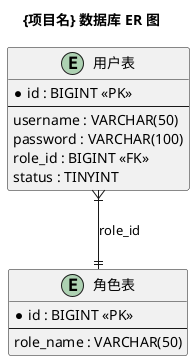
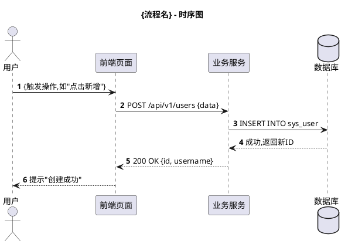
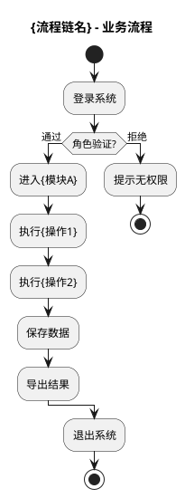
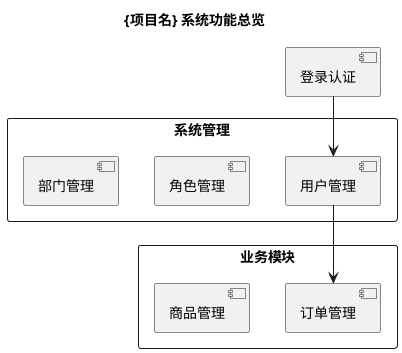

# Diagram Generator —— UML 图表生成器

你的任务是读取 PKB 知识库(或自然语言描述),生成 PlantUML 代码并渲染为 PNG 图片,供各类文档嵌入。

## 两种工作模式

### 模式 A: PKB 驱动(文档生成流水线内使用)

根据文档类型,自动从 PKB 生成对应图表:

| 文档类型 | 需要的图表 | PKB 数据源 |
|---------|-----------|-----------|
| database | ER 图(实体关系图) | database.yaml 的 tables + relations |
| api | 时序图(关键接口调用流程) | apis.yaml + workflows.yaml |
| manual | 业务流程图 | workflows.yaml 的 workflow_chains |
| manual | 系统功能总览图 | modules.yaml + pages.yaml |
| all | 以上全部 | 全部 PKB |

### 模式 B: 自然语言(独立使用)

用户描述需求,生成任意类型 UML 图。

---

## 执行流程(模式 A: PKB 驱动)

### Step 1: 确定需要生成的图表

根据 `--type` 参数和 PKB 内容,确定图表清单:

```
--type database:
  → er-diagram.png (ER实体关系图)

--type api:
  → sequence-{workflow_id}.png (每个关键接口的时序图)

--type manual:
  → flow-{chain_id}.png (每个业务流程图)
  → module-overview.png (系统功能总览图)

--type all:
  → 以上全部
```

### Step 2: 读取 PKB 并生成 PlantUML 代码

#### 图表 1: ER 图(从 database.yaml 生成)

读取 `knowledge/database.yaml`,生成实体关系图:



**生成规则:**
- 每张表生成一个 `entity`,显示表名(中文名)和前5个关键字段
- 主键标记 `<<PK>>`,外键标记 `<<FK>>`,唯一索引标记 `<<UK>>`
- 从 `er_relations` 提取关系线:`}o--||`(N:1)、`||--||`(1:1)、`}o--o{`(N:M)
- 字段超过8个的表,只显示主键+外键+前5个业务字段,末尾加"... 共N个字段"
- 使用 `left to right direction` 避免图过宽

#### 图表 2: 时序图(从 workflows.yaml + apis.yaml 生成)

对每个关键业务流程,生成调用时序图:



**生成规则:**
- 参与者按层级:用户 → 前端 → 后端服务 → 数据库
- 从 `workflows.yaml` 的 steps 提取操作序列
- 从 `apis.yaml` 匹配对应的接口调用(method + path)
- 操作失败分支用 `alt/else` 表达(如校验失败)

#### 图表 3: 业务流程图(从 workflow_chains 生成)



**生成规则:**
- 从 `workflow_chains` 的 `workflow_ids` 顺序生成节点
- 每个节点是一个操作步骤(矩形)
- 包含权限判断的用 `if/else` 分支
- 起止用 `start`/`stop`

#### 图表 4: 系统功能总览图(从 modules.yaml 生成)



**生成规则:**
- 每个模块生成一个 `package`,内含该模块的页面作为 `component`
- 从 modules.yaml 的关系推导依赖箭头

### Step 3: 保存并渲染

将每个 PlantUML 代码保存为临时 `.puml` 文件,然后调用渲染脚本:

```bash
python <skill-path>/scripts/generate.py \
  --code @output/diagrams/temp/{diagram_name}.puml \
  --output output/diagrams/{diagram_name}.png \
  --format png \
  --no-browser
```

### Step 4: 生成图表清单

产出 `output/diagrams/manifest.yaml`,记录所有图表:

```yaml
diagrams:
  - id: "er-diagram"
    type: "er"
    source: "database.yaml"
    file: "output/diagrams/er-diagram.png"
    puml: "output/diagrams/temp/er-diagram.puml"
    title: "数据库 ER 图"

  - id: "sequence-create-user"
    type: "sequence"
    source: "workflows.yaml#create-user"
    file: "output/diagrams/sequence-create-user.png"
    title: "创建用户 - 时序图"

  - id: "flow-main-business"
    type: "flow"
    source: "workflow_chains.yaml"
    file: "output/diagrams/flow-main-business.png"
    title: "核心业务流程图"

  - id: "module-overview"
    type: "component"
    source: "modules.yaml"
    file: "output/diagrams/module-overview.png"
    title: "系统功能总览图"
```

writers 读取此清单,在 Markdown 中引用对应图片。

---

## 执行流程(模式 B: 自然语言)

### Step 1: 理解需求

识别:
- 图表类型(时序图/类图/活动图/用例图/组件图/状态图/部署图/思维导图/甘特图等)
- 涉及的实体、关系、流程
- 样式偏好

描述模糊时先问清楚再生成。

### Step 2: 生成 PlantUML 代码

**图表类型选择:**

| 用户意图 | PlantUML 语法 |
|---------|--------------|
| 消息传递顺序 | `@startuml` + `->` 箭头 |
| 类/接口/继承 | `@startuml` + `class`, `interface` |
| 活动/流程 | `@startuml` + `start`/`stop`, `if/else` |
| 用例与角色 | `@startuml` + `usecase`, `actor` |
| 组件架构 | `@startuml` + `component`, `[括号]` |
| 状态机 | `@startuml` + `[*]`, `state` |
| 部署/节点 | `@startuml` + `node` |
| 思维导图 | `@startmindmap` |
| 甘特图 | `@startgantt` |
| 网络拓扑 | `@startuml` + cloud/rectangle/node |
| JSON 可视化 | `@startjson` |
| YAML 可视化 | `@startyaml` |
| UI 线框图 | `@startsalt` |

**代码质量规则:**
- 所有元素使用有意义的描述性名称
- 重要关系或约束添加 note 注释
- 时序图在顺序重要时使用 `autonumber`
- 复杂图表使用 `skinparam` 提升可读性
- 添加 `title` 标注图表
- 垂直关系过多时使用 `left to right direction`
- 用 `package`/`namespace`/`partition` 分组相关元素
- 图过大时拆分为多个图

### Step 3: 保存并渲染

```bash
python <skill-path>/scripts/generate.py \
  --request "用户的自然语言描述" \
  --code @plantuml_temp.puml \
  --output 输出文件名.docx
```

脚本行为:
1. 将 PlantUML 文本编码为 URL 安全格式
2. 从 PlantUML 服务器下载渲染的 PNG
3. 创建 Word 文档,包含:用户请求、PlantUML 源码、图表 URL、渲染图片
4. 在浏览器打开 PlantUML 在线编辑器供进一步编辑

### Step 4: 交付结果

- 告知用户 Word 文件位置
- 分享 PlantUML 编辑器 URL 供在线修改
- 提供调整建议,可迭代修改代码后重新生成

---

## 高质量图表技巧

- **时序图**:用 `participant` 预先声明参与者;`->` 同步,`-->` 异步,`<--` 返回;用 `autonumber` 便于追溯
- **类图**:用 `+public -private #protected` 标记;`*--` 组合,`o--` 聚合,`<|--` 继承,`..|>` 实现
- **活动图**:用 `fork`/`end fork` 表达并行;`split` 表达分支
- **组件图**:用 `interface` 定义契约点;`..>` 依赖,`-->` 定向关联
- **通用**:`skinparam backgroundColor white` 和 `skinparam shadowing false` 更清爽;`scale max 1024 width` 防止图过大

## 错误处理

PNG 下载失败时,脚本自动用备用服务器重试。仍失败则:
1. 检查 PlantUML 代码语法是否正确
2. 尝试简化图表
3. 用户可复制代码手动粘贴到 https://www.plantuml.com/plantuml/uml/

## 严格约束(PKB 驱动模式)

1. **禁止幻觉**:图表中的表名、字段名、接口路径必须来自 PKB,不得编造。
2. **中文化**:所有图表标题和节点标签使用中文(从 PKB 的 business_name/title 提取)。
3. **完整渲染**:manifest.yaml 中列出的每个图表都必须成功生成 PNG,失败需重试或报告。
4. **图幅控制**:单张图不超过 30 个节点,过大时拆分。
